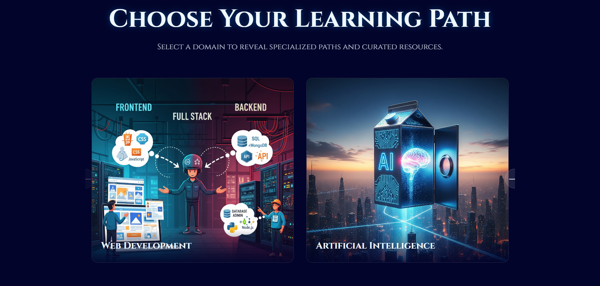
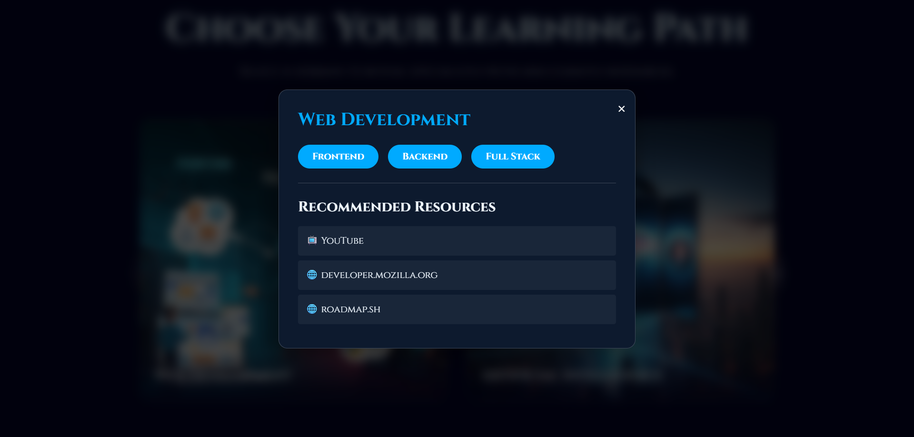
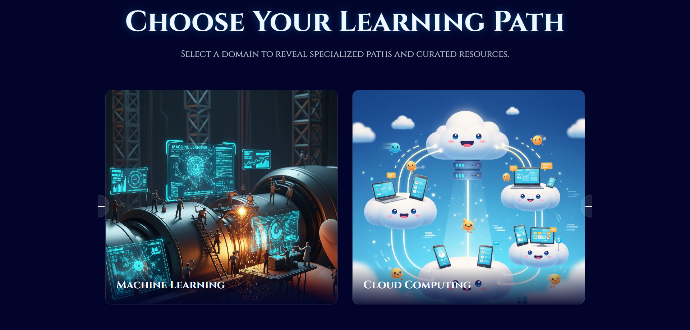
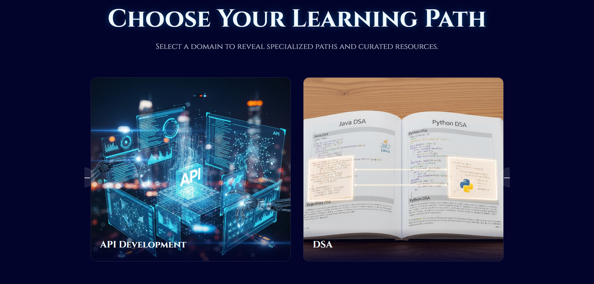
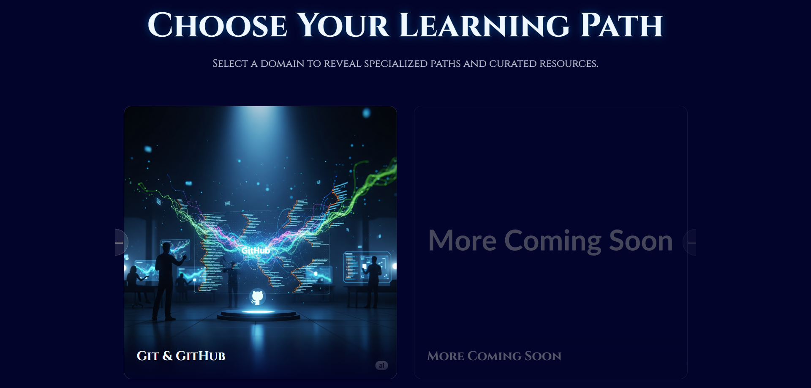

# 🚀 The SkillVerse

The SkillVerse is your all-in-one launchpad for B.Tech success. It's a curated resource hub providing clear pathways for placements, research, and mastering key technology skills.

---

## 🎬 Project Demo

*(Note: To make this work, you must first record a demo video, convert it to a GIF named `project-demo.gif`, and upload it to your repository.)*








%20(1).mp4)

---

## 📖 About The Project

This project was built to solve a common challenge for Bachelor of Technology (B.Tech) students: finding reliable, high-quality, and structured learning resources in one place.

The SkillVerse centralizes the best materials for job placements and research into a single, easy-to-navigate platform with a cinematic and engaging user experience.

> **Mission:** Empower every learner's ambition by transforming it into unparalleled skill.

---

## ✨ Key Features

- 🎥 **Cinematic Welcome:** Visually appealing welcome page with animated, cartoon-style text boxes.
- 🧭 **Interactive Course Slider:** Dynamically presents learning paths to avoid information overload.
- 🔍 **Dynamic Resource Modal:** Clicking a course card opens a detailed view with specific subtopics.
- 📚 **Curated Content:** Each subtopic links to top-tier YouTube tutorials and websites, all hand-picked.
- 🌐 **Expansive Learning Paths:** Covers essential tech domains:
  - Web Development (Frontend, Backend, Full Stack)
  - Artificial Intelligence & Machine Learning
  - Cloud Computing (AWS, GCP, Azure)
  - API Development (REST, GraphQL)
  - Data Structures & Algorithms (DSA)
  - Git & GitHub
- 📱 **Fully Responsive:** Optimized for desktop and mobile.

---

## 🛠️ Tech Stack

- **HTML5:** Semantic structure and accessibility.
- **CSS3:** Modern styling with Flexbox, Grid, variables, and animations.
- **Vanilla JavaScript (ES6+):** Handles all interactivity and rendering logic.

---

## ⚙️ Getting Started

To get a local copy up and running, follow these steps:

```bash
git clone https://github.com/Ajay3699-editor/The-Skillverse--All-in-one.git
cd The-Skillverse--All-in-one
```

Open `index.html` in your web browser.

---

## 📂 File Structure

```
The-Skillverse--All-in-one/
├── index.html            # The welcome/landing page
├── main.html             # The main hub with course cards
├── style.css             # All styling for the project
├── script.js             # All interactivity and data
├── main-bg.gif           # Animated background for the main page
├── project-demo.gif      # The GIF for this README
└── README.md             # This file
```

---

## 📬 Contact

**Ajay Babu Kante**  
🔗 [GitHub Profile](https://github.com/Ajay3699-editor)  


🔗 **Project Link:** [The SkillVerse Repository](https://github.com/Ajay3699-editor/The-Skillverse--All-in-one)

---

## 📄 License

Distributed under the MIT License. See `LICENSE` for more information.
